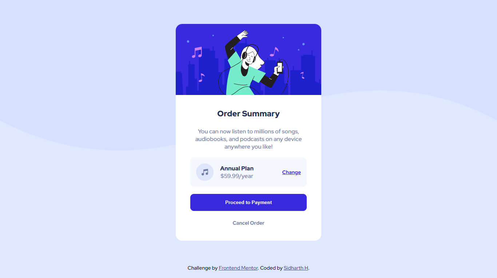

# Frontend Mentor - Order summary card solution

This is a solution to the [Order summary card challenge on Frontend Mentor](https://www.frontendmentor.io/challenges/order-summary-component-QlPmajDUj). Frontend Mentor challenges help you improve your coding skills by building realistic projects.

## Overview

### The challenge

Users should be able to:

- View the optimal layout depending on their device's screen size
- See hover states for all interactive elements on the page

### Screenshot

### Links

- Solution URL: [Frontend Mentor](https://www.frontendmentor.io/solutions/order-summary-card-componet-solution-KMo_bDQcDn)
- Live Site URL: [Netlify](https://order-card-component-sh.netlify.app/)

## Built with

- Semantic HTML5 markup
- CSS custom properties
- Flexbox

## Author

- Website - [Sidharth H.](https://www.sidharthh.in)
- Frontend Mentor - [@tenocijam](https://www.frontendmentor.io/profile/tenocijam)
- Twitter - [@tenocijam](https://www.twitter.com/tenocijam)
- Instagram - [@tenocijam](https://www.instagram.com/tenocijam)